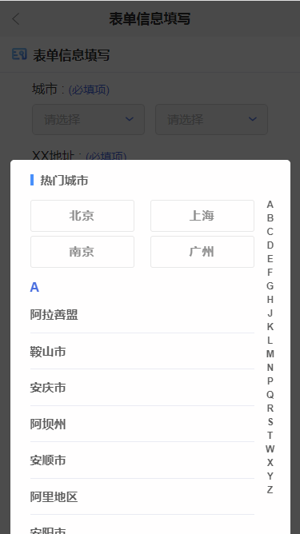
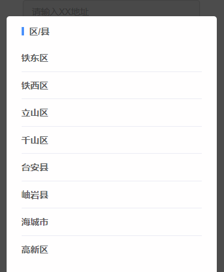

## jQ表单信息填写

### 主要功能

1. h5 jQ表单验证
2. 城市根据市、区县进行筛选

> 很多城市筛选都是三级联动，此demo只有市，没有省份，市可以根据字母进行置顶查找

### [better-scroll](https://github.com/lisashare/better-scroll)

城市可根据字母进行筛选置顶，使用better-scroll滚动插件实现

### 使用

选择Visual Studio Code 或 HBuilder, IDE 本地服务进行效果查看

> 城市选择效果图

> 区/县选择效果图

